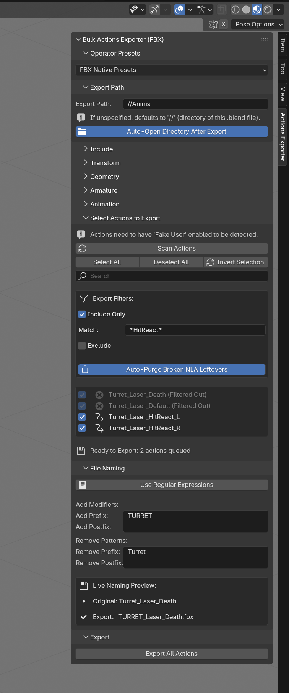

# Bulk Actions Exporter (FBX)

# Parent repository

## [sivert-io/fbx-action-exporter (*"🛠️ FBX Action Exporter for Blender"*)](https://github.com/sivert-io/fbx-action-exporter)

# About

Bulk actions exporter in FBX format for Blender 4.0+, with additional QOL options.

Renamed `export_actions.py` to `bulk_actions_exporter.py` for better consistency.

The added options are mostly written with google ai search mode, for personal use on Blender 4.5 LTS. 
I only tested this on my Windows 10 machine, so other OS users may have to tweak some parts for the exporting and Auto-open directory utilities.

Troubleshooting while adding the options took a while, took about 6 hours excluding organizing for github commit, but I found this very useful for personal workflows nonetheless, especially when re-export/re-importing animations in mass after editing a bone.

## NOTE

I will likely not maintain this, **I will likely not add more options nor be able fix issues if they arise on other users.** 
I tried my best as I was able to spend time on this, but I'm unsure if there will be issues on larger Blender files.

**Always keep backups, if used on important project files, or test on a separate `.blend` file first.**

This fork repository is mainly for personal documenting, and referencing purposes for if I have to edit/make another Blender addon again.

## Added options

- Relative path support for "Export Path"

- Can use built-in FBX exporter's custom user presets

- Rename export files: Add/remove prefix/postfix or Regex renaming, with rename preview

- Choose actions to export instead of always exporting all actions, with search bar

- Filter out actions from export list

- Auto-open directory after export

## How to use

1. Download `bulk_actions_exporter.py`

2. In Blender, go to *Edit > Preferences > Add-ons*, click the top-right 'v' button, click *Install from Disk*, and select the downloaded `.py` file. Then enable the addon.

## Preview

